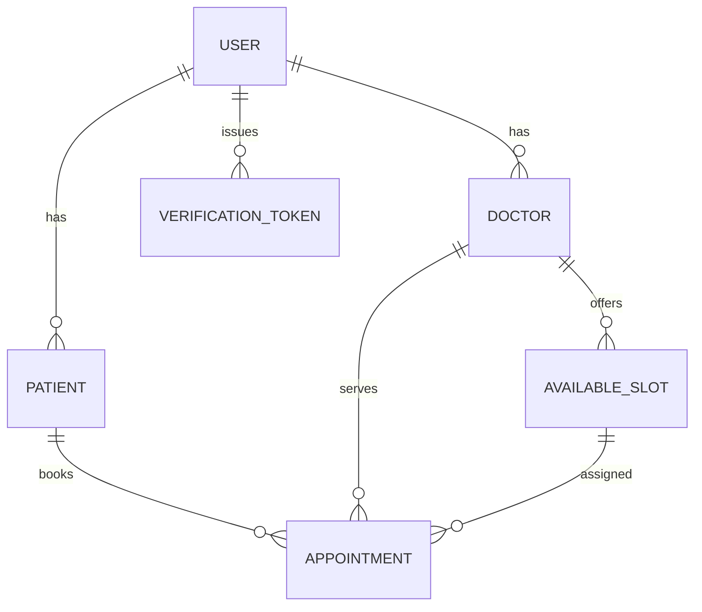

<p align="center">
  <a href="http://nestjs.com/" target="blank"></a>
</p>

[circleci-image]: https://img.shields.io/circleci/build/github/nestjs/nest/master?token=abc123def456
[circleci-url]: https://circleci.com/gh/nestjs/nest

  <p align="center">A progressive <a href="http://nodejs.org" target="_blank">Node.js</a> framework for building efficient and scalable server-side applications.</p>
    <p align="center">
<a href="https://www.npmjs.com/~nestjscore" target="_blank"></a>
<a href="https://www.npmjs.com/~nestjscore" target="_blank"></a>
<a href="https://www.npmjs.com/~nestjscore" target="_blank"></a>
<a href="https://circleci.com/gh/nestjs/nest" target="_blank"></a>
<a href="https://discord.gg/G7Qnnhy" target="_blank"></a>
<a href="https://opencollective.com/nest#backer" target="_blank"></a>
<a href="https://opencollective.com/nest#sponsor" target="_blank"></a>
  <a href="https://paypal.me/kamilmysliwiec" target="_blank"></a>
    <a href="https://opencollective.com/nest#sponsor"  target="_blank"></a>
  <a href="https://twitter.com/nestframework" target="_blank"></a>
</p>
  <!--[](https://opencollective.com/nest#backer)
  [](https://opencollective.com/nest#sponsor)-->

## Description

[Nest](https://github.com/nestjs/nest) framework TypeScript starter repository.

## Project setup

```bash
$ npm install
```

## Compile and run the project

```bash
# development
$ npm run start

# watch mode
$ npm run start:dev

# production mode
$ npm run start:prod
```

## Run tests

```bash
# unit tests
$ npm run test

# e2e tests
$ npm run test:e2e

# test coverage
$ npm run test:cov
```

## Deployment

When you're ready to deploy your NestJS application to production, there are some key steps you can take to ensure it runs as efficiently as possible. Check out the [deployment documentation](https://docs.nestjs.com/deployment) for more information.

If you are looking for a cloud-based platform to deploy your NestJS application, check out [Mau](https://mau.nestjs.com), our official platform for deploying NestJS applications on AWS. Mau makes deployment straightforward and fast, requiring just a few simple steps:

```bash
$ npm install -g @nestjs/mau
$ mau deploy
```

With Mau, you can deploy your application in just a few clicks, allowing you to focus on building features rather than managing infrastructure.

## Resources

Check out a few resources that may come in handy when working with NestJS:

- Visit the [NestJS Documentation](https://docs.nestjs.com) to learn more about the framework.
- For questions and support, please visit our [Discord channel](https://discord.gg/G7Qnnhy).
- To dive deeper and get more hands-on experience, check out our official video [courses](https://courses.nestjs.com/).
- Deploy your application to AWS with the help of [NestJS Mau](https://mau.nestjs.com) in just a few clicks.
- Visualize your application graph and interact with the NestJS application in real-time using [NestJS Devtools](https://devtools.nestjs.com).
- Need help with your project (part-time to full-time)? Check out our official [enterprise support](https://enterprise.nestjs.com).
- To stay in the loop and get updates, follow us on [X](https://x.com/nestframework) and [LinkedIn](https://linkedin.com/company/nestjs).
- Looking for a job, or have a job to offer? Check out our official [Jobs board](https://jobs.nestjs.com).

## Support

Nest is an MIT-licensed open source project. It can grow thanks to the sponsors and support by the amazing backers. If you'd like to join them, please [read more here](https://docs.nestjs.com/support).

## Stay in touch

- Author - [Kamil Myśliwiec](https://twitter.com/kammysliwiec)
- Website - [https://nestjs.com](https://nestjs.com/)
- Twitter - [@nestframework](https://twitter.com/nestframework)

## License

Nest is [MIT licensed](https://github.com/nestjs/nest/blob/master/LICENSE).

---

## Backend API Overview

This repository contains the backend for a scheduling application built with NestJS and Prisma. The focus is on authentication, registration, and onboarding (week 1 deliverables).

### Features implemented

- REST API prefixed at `/api/v1`
- User model with roles (`patient` / `doctor`)
- Email/phone signup & login with password hashing
- Google OAuth flow (patient or doctor) – pass `state=doctor` query to create a doctor account,
  otherwise defaults to patient. Callback returns JWT.
- JWT based auth (access token signed with `JWT_SECRET`, optional cookie `jid`)
- Verification tokens for email/phone (6‑digit code logged to console)
- Onboarding endpoint to complete profile (patient/doctor data)
- Prisma schema with relationships for users, patients, doctors, slots, appointments
- Postman collection available under `postman/Scheduler_Auth.postman_collection.json` (the minimal version can be imported into Hoppscotch or any HTTP client for testing)

### Authentication endpoints

| Method | Path                      | Description |
|--------|---------------------------|-------------|
| POST   | `/api/v1/auth/signup`     | register with email/phone/password and select `role` |
| POST   | `/api/v1/auth/login`      | login with email or phone + password |
| POST   | `/api/v1/auth/signout`    | clear auth cookie; client should drop token (logout) |
| GET    | `/api/v1/auth/me`         | return current user (JWT guard) |
| GET    | `/auth/google?state=doctor` or `state=patient` | start Google OAuth (redirect, use browser) |
| GET    | `/auth/google/callback`   | OAuth callback returns JWT |

### Appointment endpoints (Week 2)

| Method | Path                                      | Description |
|--------|-------------------------------------------|-------------|
| GET    | `/api/v1/appointments/doctors`            | list doctors (optional `?specialization=`) |
| POST   | `/api/v1/appointments`                    | book appointment (patient only) |
| POST   | `/api/v1/appointments/:id/cancel`         | cancel your appointment |
| GET    | `/api/v1/appointments`                    | fetch current patient’s appointments |

### Doctor-specific endpoints (week 1 & 2)

| Method | Path                                      | Description |
|--------|-------------------------------------------|-------------|
| GET    | `/api/v1/doctor/profile`                  | get own profile (doctor only) |
| PUT    | `/api/v1/doctor/profile`                  | update profile / specializations |
| POST   | `/api/v1/doctor/slots`                    | create availability slot |
| GET    | `/api/v1/doctor/slots`                    | list your slots |
| GET    | `/api/v1/doctor/appointments`            | fetch appointments assigned to you |
| POST   | `/api/v1/doctor/appointments/:id/cancel` | cancel an appointment as a doctor |

| POST   | `/api/v1/auth/request-verification` | generate OTP for email/phone (requires JWT) |
| POST   | `/api/v1/auth/verify`     | submit OTP and type (`email`/`phone`) |
| POST   | `/api/v1/auth/onboard`    | complete profile details |
| POST   | `/api/v1/auth/google`     | start OAuth flow (stubbed) |
| POST   | `/api/v1/auth/google/callback` | OAuth callback (stubbed) |

### Database and ER Diagram

The Prisma schema lives at `prisma/schema.prisma`. The core entities are:

- **User** (with verification and onboarding flags)
- **Patient** and **Doctor** (subtypes holding profile info)
- **AvailableSlot** and **Appointment** for scheduling
- **VerificationToken** for OTP codes

Below is a simple ER diagram illustrating relationships:



> You can generate a visual version by running `npx prisma studio` or using any ERD tool with the schema.

### Local setup

1. Install dependencies: `npm install`.
2. Create `.env` with at least `DATABASE_URL` and `JWT_SECRET`. For Google login add the `GOOGLE_*` values or omit to disable.
3. Migrate the database:
   ```bash
   npx prisma migrate dev --name init
   ```
4. (Optional) seed or inspect with `npx prisma studio`.
5. Start development server: `npm run start:dev`.

Use the Postman (or Hoppscotch) collection to exercise the API; the `signup` request already sets a random role and password. Week 2 appointments endpoints have also been added to the minimal collection.

---

*By pruning views and controllers this backend is now purely REST‑oriented. The previous handlebars templates and `public` assets have been removed to keep the focus on server‑side logic.* 
